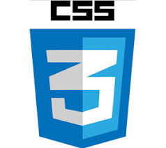

# Revisão sobre tecnologias da WEB

## HTML


É a sigla de HyperText Markup Language, expressão inglesa que significa "Linguagem de Marcação de Hipertexto". Consiste em uma linguagem de marcação utilizada para produção de páginas na web, que permite a criação de documentos que podem ser lidos em praticamente qualquer tipo de computador e transmitidos pela internet.

Para escrever documentos HTML não é necessário mais do que um editor de texto simples e conhecimento dos códigos que compõem a linguagem. Os códigos (conhecidos como tags) servem para indicar a função de cada elemento da página Web. Os tags funcionam como comandos de formatação de textos, formulários, links (ligações), imagens, tabelas, entre outros.

Os browsers (navegadores) identificam as tags e apresentam a página conforme está especificada. Um documento em HTML é um texto simples, que pode ser editado no Bloco de Notas (Windows) ou Editor de Texto (Mac) e transformado em hipertexto.

- <https://developer.mozilla.org/pt-BR/docs/Web/HTML/Element>
- <https://www.w3c.br/pub/Cursos/CursoHTML5/html5-web.pdf>
- <https://www.devmedia.com.br/comandos-e-tags-html5/23618>

> Exemplo:

```html
<!doctype html>
<html>
  <head>
    <title>Este é o título da nossa página!</title>
  </head>
  <body>
    <p>Este é um exame de um paragrafo.</p>
  </body>
</html>
```

---

## JavaScript


É uma linguagem de programação criada em 1995 por Brendan Eich enquanto trabalhava na Netscape Communications Corporation. Originalmente projetada para rodar no Netscape Navigator, ela tinha o propósito de oferecer aos desenvolvedores formas de tornar determinados processos de páginas web mais dinâmicos, tornando seu uso mais agradável. Um ano depois de seu lançamento, a Microsoft portou a linguagem para seu navegador, o que ajudou a consolidar a linguagem e torná-la uma das tecnologias mais importantes e utilizadas na internet.

- <https://developer.mozilla.org/pt-BR/docs/Learn/JavaScript>

> Exemplo:

```js
function sum(a,b) {
  return a + b;
}
```

---

## CSS3



É a sigla para o termo em inglês Cascading Style Sheets que, traduzido para o português, significa Folha de Estilo em Cascatas. O CSS é fácil de aprender e entender e é facilmente utilizado com as linguagens de marcação HTML ou XHTML.

- <https://web.dev/i18n/pt/learn/css/>

> Exemplo:

```css
body {
  background-color: 'red'
}
```

---

## Web Developer Roadmap


Podemos ver que hoje em dia Frontend pode ter muitas vertentes, totalmente diferente do que poderíamos ver alguns anos atrás.

* <https://roadmap.sh/frontend>

[Voltar](../readme.md)
